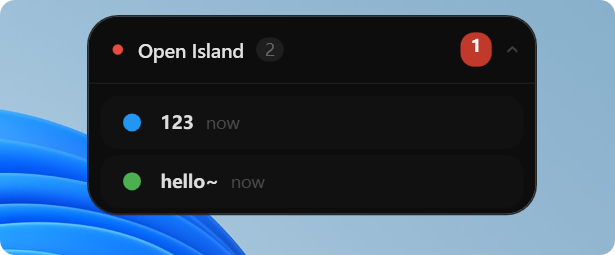

<div align="center">

# 🟣 Open Island

**A macOS-style Dynamic Island for AI coding agents on Windows**

[](LICENSE)
[](https://dotnet.microsoft.com/download/dotnet/8.0)
[]()

[English](README.md) · [简体中文](README.zh-CN.md)

<br/>

&nbsp;&nbsp;

<sub>The header sprite is a pixel-art animation bound to session phase — blue &amp; bouncing while Claude works, red &amp; resting when idle/done. Live CPU·RAM·GPU·net bar and media controls sit right below.</sub>

</div>

---

Open Island is a Windows tray companion that surfaces the live state of AI coding agents (primarily Claude Code) on a macOS-inspired Dynamic Island floating at the top of your screen — including permission prompts, token usage, active sessions, and notch-style snap mode.

- 🎮 **Pixel status sprite** — the header status indicator is an animated pixel-art sprite bound to session phase: bouncing while Claude works, resting (with a short idle animation every 30s) when done
- 📈 **System stats bar** — live CPU / RAM / GPU / network throughput, refreshed every second
- 🎵 **Media controls** — prev / play-pause / next + a system volume slider, works with any player (Spotify, browser, music apps…)
- 📡 **Permission mirror** — Claude Code's `PreToolUse` prompts mirror to the island so you can decide `1/2/3` without alt-tabbing back to the terminal
- 📊 **Stats dashboard** — sessions / tokens / model breakdown / activity heatmap, with All / 30d / 7d filters
- 🪟 **Notch mode** — drag near the top of the screen to snap into a macOS-notch-shaped capsule
- 🚀 **One-click resume** — clicking a session card runs `claude --resume {sessionId}` for CLI sessions, or brings the Claude Desktop app window to the front for desktop sessions

Stays out of the way — sits in collapsed mode at the top of the screen while you play DOTA, write code, or watch a stream:


---

## ✨ Features

- **Pixel status sprite** — the header indicator is a pixel-art sprite (Aseprite sheet, nearest-neighbor + integer scaling so it stays crisp at 125% / 150% DPI) bound to `SessionPhase`:
  - **Running** → continuous loop + a gentle up-and-down bounce
  - **Idle / Completed** → holds the last frame, then every 30s randomly picks one of several idle variants (`idle.png` / `idle2.png` / `idle3.png` … auto-discovered, drop a file in to add one) and plays it once

  &nbsp;&nbsp;

- **System stats bar** — a row of CPU / RAM / GPU / network speed between the header and the session list, refreshed every second (`GetSystemTimes` / `GlobalMemoryStatusEx` / GPU Engine counters / `NetworkInterface`)
- **Media controls** — prev / play-pause / next (system media keys, works with Spotify, browsers, any player) plus a system volume slider (CoreAudio `IAudioEndpointVolume`, two-way synced)
- **Session card dismiss** — a small × on each card to temporarily hide a session; it reappears on its next activity (a new Running round or an attention phase)
- **Dynamic Island** — floating top-screen indicator for active sessions, tagged by tool icon, project name, and a colored status dot
- **Permission mirror** — Claude Code's `PreToolUse` permission prompts are mirrored to the island. The three buttons inject `1` / `2` / `3` keystrokes into the Claude terminal via `SendInput`, equivalent to typing them yourself

  

- **Notch snap** — drag the island to within 28px of the top of the screen and release to snap into a macOS-notch-style capsule; drag back down past 48px to restore the floating form

  
- **Control Center** — three tabs:
  - **Sessions** — all Claude conversations (sorted by transcript mtime)
  - **Overview** — Total tokens / Active days / Current/Longest streak / Peak hour / Favorite model + 84-day activity heatmap
  - **Models** — token share per model + I/O breakdown
- **Workspace filter** — restrict statistics to sessions whose `cwd` is under your configured project root(s)
- **Stop hook completion signal** — the green "task complete" indicator and beep fire only when Claude Code emits a real `Stop` hook (true `end_turn` / `stop_sequence`), not on every mid-task `end_turn`
- **CLI / Desktop routing** — clicking a session card auto-detects the transcript's `entrypoint`:
  - `cli` → opens a new terminal running `claude --resume`
  - `claude-desktop` → activates the Claude Desktop window

## 📦 Installation

Grab a build from [Releases](../../releases). Two flavors:

- 🟢 **Recommended** — `OpenIsland-Setup-X.Y.Z-win-x64.exe` — standard installer; installs into `%LOCALAPPDATA%\OpenIsland` without admin, registers in Add/Remove Programs, optional auto-start at login
- 🟦 **Portable** — `OpenIsland-vX.Y.Z-win-x64.zip` — extract anywhere and run; no registry writes

> ⚠️ Builds are not code-signed. Windows SmartScreen will warn — click **More info → Run anyway**. For the zip, right-click → Properties → Unblock first.

## 🏃 Quick Start

1. Run `OpenIsland.exe` — a purple icon appears in the system tray
2. The Dynamic Island shows up at the top of your screen
3. Start a Claude Code session: `claude` or `claude --resume`
4. Trigger any tool that needs permission (e.g. WebFetch) — the island shows the same prompt the terminal does

The system tray menu → **Control Center** opens the full dashboard.

## 🛠 Build From Source

Requires Windows + .NET 8 SDK.

```powershell
git clone https://github.com/ludiwangfpga/open-island-windows.git
cd open-island-windows
dotnet build OpenIsland.sln -c Release
dotnet run --project src/OpenIsland.App/OpenIsland.App.csproj
```

After modifying hook binaries, run the deploy script to repackage and reinstall:

```powershell
powershell -ExecutionPolicy Bypass -File scripts\deploy.ps1
```

See [CONTRIBUTING.md](CONTRIBUTING.md) and [ARCHITECTURE.md](ARCHITECTURE.md) for more.

## 🏗 Architecture

```
AI agent (Claude Code / Codex / Cursor / ...)
   │ stdin JSON
   ▼
open-island-hooks.exe   (per-event subprocess)
   │ Named Pipe "OpenIsland_Pipe"
   ▼
BridgeServer ──► SessionManager ──► SessionState (event-sourced)
   │                                   │
   ▼                                   ▼
DynamicIslandWindow / ControlCenter   SessionRegistry (persistence)
```

Full details in [ARCHITECTURE.md](ARCHITECTURE.md).

## 🤝 Contributing

Issues and PRs welcome. The codebase uses bilingual comments (English XML docs + Chinese inline context); see [CONTRIBUTING.md](CONTRIBUTING.md).

## 🙏 Acknowledgements

Built on these excellent open-source libraries (all MIT/BSD):
- [CommunityToolkit.Mvvm](https://github.com/CommunityToolkit/dotnet) — MVVM helpers
- [Hardcodet.NotifyIcon.Wpf](https://github.com/hardcodet/wpf-notifyicon) — system tray icon
- [System.CommandLine](https://github.com/dotnet/command-line-api) — CLI parsing for hooks
- The Claude Code team — for designing a clean hook protocol

## 📄 License

[MIT](LICENSE) © 2025 ludiwangfpga
