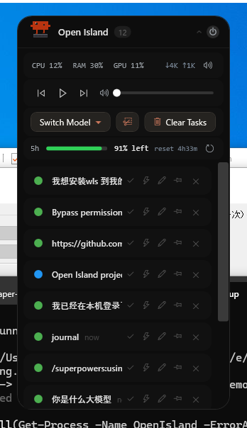
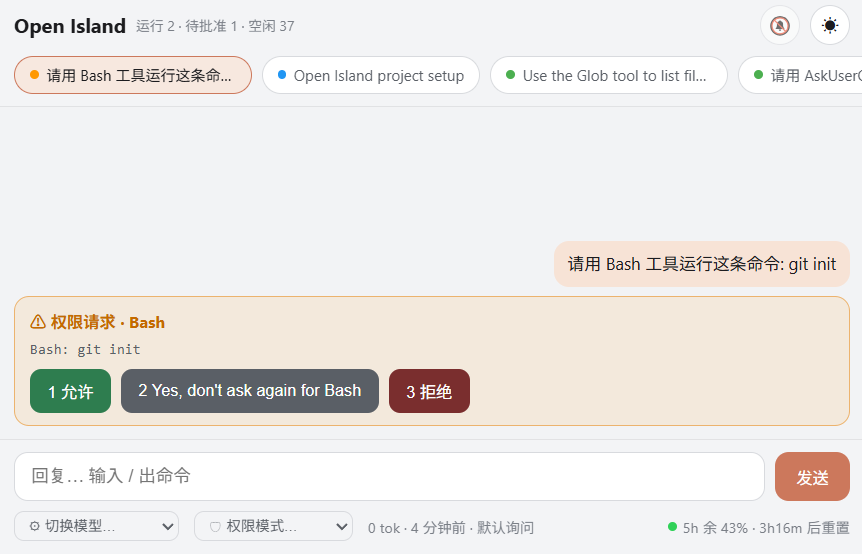
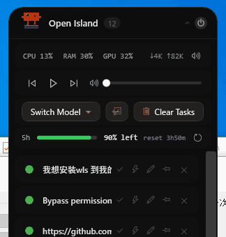

<div align="center">

# 🟣 Open Island

**Windows 上的 AI 编码助手控制中心 · 仿 macOS 灵动岛**

[](LICENSE)
[](https://dotnet.microsoft.com/download/dotnet/8.0)
[]()

[English](README.md) · [简体中文](README.zh-CN.md)

<br/>



<sub>头部精灵是橙色 <strong>Claude 小宠物</strong> —— 绑定会话阶段的像素动画（工作 / 需关注 / 完成 / 空闲）。下方依次是实时 CPU·内存·GPU·网速栏、媒体控制、一键切换模型、区域截图按钮，以及 Claude 订阅的 5 小时用量余额 —— 点一下即可翻成最近七天 token 用量柱状图。</sub>

</div>

---

Open Island 是一个常驻托盘的桌面助手，把 Claude Code 等 AI 编码代理的运行状态、Token 用量、权限请求都汇聚到屏幕顶部一个 macOS 风格的"灵动岛"上。

- 🎮 **像素状态精灵** —— 头部状态指示器是绑定会话阶段的像素动画：Claude 工作时跳动，完成后休息（每 30s 随机播一遍空闲小动作）
- 📈 **系统状态栏** —— 实时 CPU / 内存 / GPU / 网速，1 秒刷新一次（GPU 在非英文 Windows 也能正常显示）
- 🔔 **提示音** —— 任务完成、会话需关注时各响一声；状态栏有喇叭开关静音
- 🎵 **媒体控制** —— 上一首 / 播放暂停 / 下一首 + 系统音量滑块，网易云 / Spotify / 浏览器 / 任意播放器通用
- 📡 **实时镜像** Claude Code 的权限询问，让你不用切回终端就能 `1/2/3` 决策
- ⚡ **每会话模式按钮** —— 会话卡上的快捷图标按钮，一键切该会话的权限模式（accept edits / auto / plan）
- 📊 **统计面板** —— sessions / token / 模型占比 / 活跃热力图，全部 / 30 天 / 7 天三档可切
- 🚀 **一键跳回** —— 点卡片直接 `claude --resume {sessionId}` 恢复历史会话；桌面端会话则把客户端窗口拉前台

不打扰你 —— 折叠态停在屏顶，打游戏 / 写代码 / 看直播都不挡视野：


---

## 🗺 功能总览

| 板块 | 能力 |
|---|---|
| **🏝 灵动岛本体** | 像素宠物状态精灵 · 系统状态栏（CPU / RAM / GPU / 网速）· 媒体控制 + 音量滑块 · 任务完成 / 需关注提示音 · 区域截图（全局快捷键）· 5h 订阅余额 ↔ 七天用量柱状图 · 屏顶 Notch 吸附 · 中英双语 |
| **🗂 会话管理** | 权限询问镜像（1/2/3 一键回）· AskUserQuestion 选项按钮 · 每会话权限模式快切 · 快捷回复 · 一键跳回终端 / 客户端 · 图钉固定 · 清理任务（有新活动才重现）· 来源筛选（全部 / 终端 / 客户端）· Skill 一键安装 |
| **📱 网页同步** | 手机平板局域网访问 · SSE 实时推送 · 聊天式回复 + `/` 命令补全 · 权限一键审批 · 提问选项作答 · 切模型 / 切权限模式 · 声音 + 标题提醒 · 日夜主题 · 添加到主屏幕 |
| **🤖 模型与统计** | 一键切换模型（官方全系 + 第三方档，API Key DPAPI 加密）· 控制中心三 Tab（Sessions / Overview / Models）· 84 天活跃热力图 · 工作区过滤 |

## ✨ Features

- **📱 网页同步（手机 / 平板远程工作台）** —— 头部地球按钮一键开启本机 18686 端口迷你 HTTP 服务（零依赖、手动开关，开启时地址自动复制）。同一局域网的手机 / 平板打开即是一个完整的移动工作台：
  - **实时** —— SSE 推送（会话一有变化页面秒级更新），断线自动降级轮询、恢复自动切回
  - **多会话标签** —— 顶部标签切换会话，聊天式单会话视图（贴底滚动、每会话独立草稿）；灵动岛上点会话状态圆点可把该对话置顶同步（⭐ + 60 条完整历史）
  - **能对话** —— 底部输入框直接回复进终端 / 桌面端（复用快捷回复注入通道），输入 `/` 弹出命令自动补全
  - **能审批** —— 权限请求显示橙色卡片（工具名 + 命令描述），允许 / 都允许 / 拒绝三按钮，躺沙发上用手机点一下即可
  - **能回答提问** —— Claude 用 AskUserQuestion 提问时，网页渲染**选项按钮**（含描述提示）+ 跳过，点选项即作答；也可输入框自由回复
  - **能切模式 / 模型** —— 工具行两个下拉：权限模式（默认询问 / 自动接受编辑 / 计划 / auto，按 hook 上报的当前模式精确连发 Shift+Tab 直达目标）与模型切换（注入 `/model`）
  - **会提醒** —— 新待批准时两短声提示音（铃铛开关记忆），页面切后台时标题闪烁"● 待批准 N"
  - **看得舒服** —— 代码块 / diff 行色 / 内联代码富渲染、长消息折叠、相对时间、tokens 人类化、5h 余额行、日 / 夜主题、添加到主屏幕有小人图标

  

- **安装 Skill** —— 命令栏"安装 Skill"按钮：粘贴 `claude plugin` 命令（支持连写 / `&&` / 换行）或 `owner/repo` 简写，后台静默调用 claude CLI 安装并实时显示输出；严格白名单校验防命令注入
- **会话来源筛选** —— 命令栏三态按钮：全部 → 仅终端(CLI) → 仅客户端(Claude Desktop) 循环切换，筛选时按钮高亮并切换字形

- **区域截图** —— "清理任务"旁边一个截图按钮，外加全局快捷键（默认 **Ctrl+Q**，控制中心可改）：微信式拖拽框选一个矩形，松手自动复制到剪贴板，随处粘贴
- **七天用量柱状图** —— 点击 5 小时余额行，翻成**最近七天 token 用量柱状图**（用量越多绿色越深越高，右侧只显示总量），再点切回余额。下次启动灵动岛记住关闭时的状态
- **切换模型** —— 音量栏下方"切换模型"按钮，点开弹出模型列表即切换。控制中心可添加第三方模型（参考 cc-switch 预设 —— DeepSeek / 智谱 GLM / Kimi / 通义千问 / OpenRouter / 硅基流动 / Novita / ModelScope / 小米 MiMo … 预填地址，只需填 API Key）。官方 Claude 档客户端 + CLI 都生效；第三方档写 `~/.claude/settings.json` 的 env、对新 CLI 会话生效。API Key 以 Windows DPAPI 加密落盘
- **订阅 5 小时余量** —— 音量栏下方一行显示 Claude 订阅"5 小时滚动窗口"剩余额度（绿色余额条 + "余 XX%" + 重置倒计时），数据来自 `/api/oauth/usage`（与 `/usage` 同源，零 token 开销），5 分钟自动刷新，行尾刷新按钮可手动立即刷新
- **中英文界面切换** —— 托盘右键 / 控制中心切换 中文 / English，默认跟随 Windows 系统语言，切换后持久化
- **图钉固定会话** —— 会话卡右侧图钉按钮，被固定的会话"清理任务"不会清掉它
- **点击 CPU% / RAM% 释放内存** —— 清理各进程工作集（类 RAM 清理工具），RAM% 随后下降
- **像素状态精灵** —— 头部指示器是像素动画（Aseprite sprite sheet，NearestNeighbor + 整数倍缩放，125% / 150% DPI 不糊），绑 `SessionPhase`：
  - **Running** → 小宠物在忙碌敲键盘（两只眼睛一大一小、会眨眼）
  - **Idle** → 每约 3 分钟随机切换四个默认动画之一（眨眼两下 / wink / 睡觉打 `zz` 吐泡泡 / 喝可乐）
  - **Completed** → 放烟花 🎉；**需关注** → 头顶冒出 `?`
  
  

- **系统状态栏** —— 头部与会话列表之间一行 CPU / 内存 / GPU / 网速，1 秒刷新（`GetSystemTimes` / `GlobalMemoryStatusEx` / GPU Engine 计数器 / `NetworkInterface`）。GPU 利用率改用 PDH **英文计数器** API（`PdhAddEnglishCounterW`）读取，与系统语言无关，非英文 Windows 也显示真实 %；列宽固定，CPU/RAM/GPU 不随网速文本宽度变化抖位
- **提示音** —— 会话从 Running → Idle/Completed（任务完成）以及进入需关注状态（橙色权限 / 红色待答）时各响一声；系统状态栏的喇叭按钮静音/取消静音（持久化）
- **媒体控制栏** —— 上一首 / 播放暂停 / 下一首（系统媒体键，网易云 / Spotify / 任意播放器通用）+ 系统音量滑块（CoreAudio `IAudioEndpointVolume`，双向同步）
- **每会话快捷模式按钮** —— 每张会话卡有小图标按钮（hover 显示 "accept edits" / "auto mode" / "plan mode"）一键切该 Claude 会话的权限模式，外加一个 × 临时收起卡片；收起的卡片在转录**真有新内容**落盘（或弹出需关注的提问 / 权限）时自动重现
- **清理任务** —— 命令栏垃圾桶按钮一键清空会话列表（运行中 / 需关注 / 图钉固定的保留）；被清的会话只有**真有新活动**才会回来，不会因为进程波动集体复活
- **Dynamic Island** —— 屏顶悬浮的活跃会话指示器，按工具图标 + 项目名 + 状态点显示
- **Permission mirror** —— Claude Code 的 PreToolUse 权限询问会同时镜像到岛上，配合三按钮（Yes / Yes don't ask again / No），点击会通过 SendInput 注入对应数字到 Claude 终端

  

- **Control Center** —— 三 Tab：
  - **Sessions** 列出所有 Claude 会话（按 mtime 排序）
  - **Overview** Token 总量 / 活跃天数 / 连续天数 / 高峰小时 / 最常用模型 / 84 天活动热力图
  - **Models** 按模型分组的 Token 占比 + I/O 详情
- **Workspace 过滤** —— 设置里指定项目目录，统计仅算 cwd 在该目录下的会话
- **Stop hook 触发任务完成** —— Claude Code 真正 `end_turn` 时桌面响铃 + 灵动岛绿灯闪
- **CLI / 桌面端区分** —— 点击会话卡自动判断 entrypoint（取转录文件**最新**一行的值，会话从桌面端 `--resume` 到 CLI 后也判得对），并且只在"终端宿主"的 `claude.exe` 里找终端（排除桌面端常驻派生的大量子进程）：CLI 会话**激活已有终端**（终端已关才开新 tab 跑 `claude --resume`），桌面端会话激活客户端窗口

## 🎭 表情

头部精灵是橙色 **Claude 小宠物**，它的小动画一眼告诉你灵动岛当前状态（都是极小的循环动图）：

| | 状态 | | 状态 |
|:--:|---|:--:|---|
|  | **工作中** —— Claude 戴眼镜思考 |  | **需关注** —— 等你确认 / 回答（头顶 `?`） |
|  | **完成** —— 任务结束 🎉 放烟花 |  | **空闲** —— 休息中，每隔几分钟随机切换下面四个之一 |
|  | 空闲 · 眨眼两下 |  | 空闲 · wink |
|  | 空闲 · 睡觉（`zz`、吐泡泡） |  | 空闲 · 喝可乐 |
|  | **媒体** —— 调音量 / 切歌时播放 |  | **彩蛋** —— 点一下小宠物 |
|  | **关闭** —— 点关机键隐藏灵动岛 | | |

## 📦 安装

> **自包含** —— 已打包 .NET 8 运行时，无需额外安装任何依赖，只要 Windows 10/11（x64）。

从 [Releases](../../releases) 下载，二选一：

- 🟢 **推荐** · `OpenIsland-Setup-X.Y.Z-win-x64.exe` —— 标准安装包，双击自动装到 `%LOCALAPPDATA%\OpenIsland`，无需管理员，可在 Add/Remove Programs 卸载，可选开机自启
- 🟦 **绿色版** · `OpenIsland-vX.Y.Z-win-x64.zip` —— 解压即用，不写注册表

> ⚠️ 未做代码签名，Windows SmartScreen 会拦截。点 **更多信息 → 仍要运行** 即可。zip 版需要先右键属性 → 解除锁定。

首次启动会自动在 `%USERPROFILE%\.claude\settings.json` 注册 Claude Code 的 hook（`PreToolUse` / `PostToolUse` / `Stop` 三种），无需手动操作。

## 🏃 快速开始

1. 启动 `OpenIsland.exe`，托盘出现紫色岛标
2. 屏顶出现"Open Island"灵动岛
3. 在终端开个 Claude Code 会话：`claude` 或 `claude --resume`
4. 跑任何需要权限的工具（fetch、Edit 等），岛上会同步出权限提示

托盘菜单 → **Control Center** 可看完整 dashboard。

## 🛠 从源码构建

要求 Windows + .NET 8 SDK。

```powershell
git clone https://github.com/ludiwangfpga/open-island-windows.git
cd open-island-windows
dotnet build OpenIsland.sln -c Release
dotnet run --project src/OpenIsland.App/OpenIsland.App.csproj
```

开发期改 hook 二进制后，跑部署脚本一键重装：

```powershell
powershell -ExecutionPolicy Bypass -File scripts\deploy.ps1
```

详见 [CONTRIBUTING.md](CONTRIBUTING.md) 和 [ARCHITECTURE.md](ARCHITECTURE.md)。

## 🏗 架构

```
AI agent (Claude Code / Codex / Cursor / ...)
   │ stdin JSON
   ▼
open-island-hooks.exe   (per-event subprocess)
   │ Named Pipe "OpenIsland_Pipe"
   ▼
BridgeServer ──► SessionManager ──► SessionState (event-sourced)
   │                                   │
   ▼                                   ▼
DynamicIslandWindow / ControlCenter   SessionRegistry (持久化)
```

具体细节看 [ARCHITECTURE.md](ARCHITECTURE.md)。

## 🤝 Contributing

欢迎 PR / issue。代码用双语注释（英文 XML doc + 中英行内皆可），具体规范见 [CONTRIBUTING.md](CONTRIBUTING.md)。

## 🙏 Acknowledgements

依赖以下开源库（皆 MIT/BSD）：
- [CommunityToolkit.Mvvm](https://github.com/CommunityToolkit/dotnet) — MVVM 工具
- [Hardcodet.NotifyIcon.Wpf](https://github.com/hardcodet/wpf-notifyicon) — 系统托盘
- [System.CommandLine](https://github.com/dotnet/command-line-api) — Hooks CLI 解析
- Claude Code 团队 —— hook 协议设计

## 📄 License

[MIT](LICENSE) © 2025 ludiwangfpga
